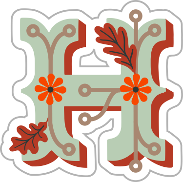

<!--
**rusadirr/rusadirr** is a ✨ _special_ ✨ repository because its `README.md` (this file) appears on your GitHub profile.

Here are some ideas to get you started:

- 🔭 I’m currently working on ...
- 🌱 I’m currently learning ...
- 👯 I’m looking to collaborate on ...
- 🤔 I’m looking for help with ...
- 💬 Ask me about ...
- 📫 How to reach me: ...
- 😄 Pronouns: ...
- ⚡ Fun fact: ...
-->

<h1 align="center">Hello there, I'm Rusadi!</h1>

### 👨‍💻 &nbsp; About Me

💡 &nbsp;I'm very interested in technological developments.\
🎓 &nbsp;I'm currently studying in the Major of Informatics, Networking, and Application System at SMK Negeri 1 Cimahi.\
🌱 &nbsp;I’m currently learning : 
- 🛡️ Cyber Security (Linux, Network, CyberSecurity Analyst & Penetration Testing), 
- ☁️ Cloud Computing (Docker, Ansible, Kubernetes, Ceph & Openstack) and 
- 💻 Programming (Python, PHP & CSS).

✍️ &nbsp;In my free time, [I Write some articles in the field of technology](https://project.rusadi.me/), [Blog Writing](https://blog.rusadi.me/) and Playing Guitar as my hobbies.\
💬 &nbsp;Feel free to reach out to me for ask anything or just for some interesting discussion.\
📫 &nbsp;You can shoot me an email at muhammadrusadir@gmail.com! I'll try to respond as soon as I can.\
🌐 &nbsp;Please have a look at my [Personal Websites](https://rusadi.me) for more details about me. I'm open to feedback and suggestions! \
⚡ Fun fact : The music group that I like the most is [JKT48.](https://jkt48.com/)

This is my personal repository Feel free to check my repository, don't forget to notify me if you found something wrong 

### 🛠️ &nbsp; Tech

<!--

-->

  
  
  
  

### 
🥇 &nbsp; Badges  

### 
⚙️ &nbsp; My GitHub Analytics

<!-- 

BUAT BLOG  

-->

### 🔗 &nbsp; Let's Connect With Me!

  

  

  

<h2 align='center'>Nice to see you here </h2>
 

</img>

 
